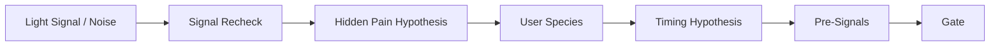
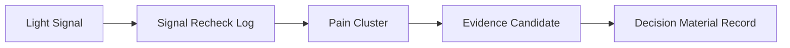
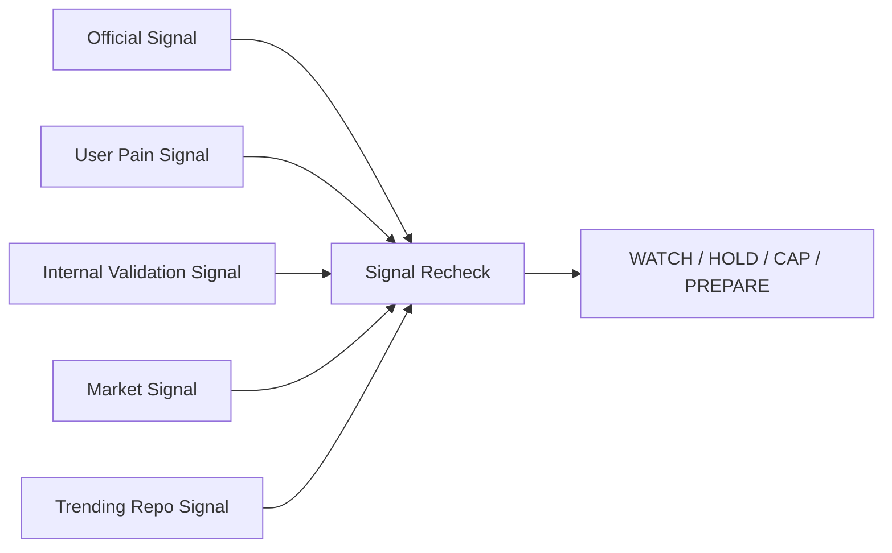

# Visual Overview

## Manual Signal Recheck Flow

## Accumulation Flow

## Signal Source Flow

## Boundary

These diagrams are documentation only. They do not authorize chart renderer, dashboard, automation, scraping, API, or implementation.
